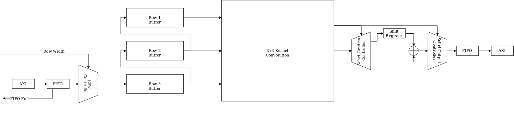
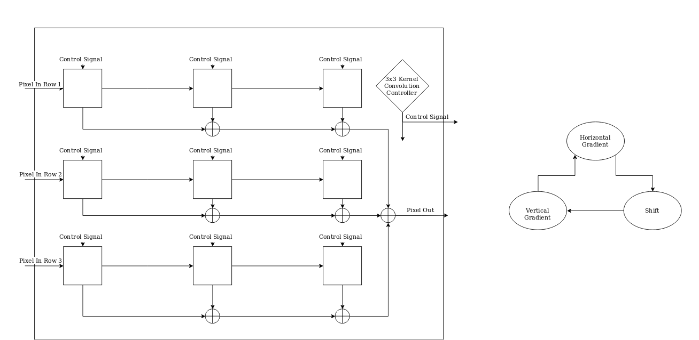
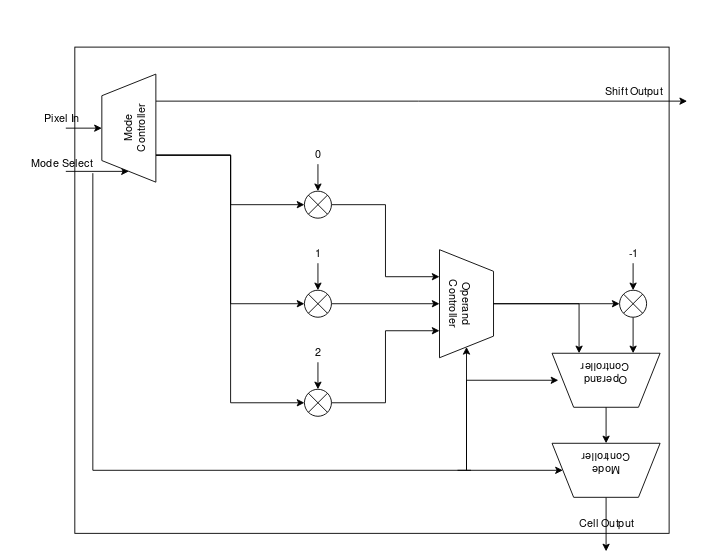

# Assignment 1: FPGA Sobel Architecture

Justin Nguyen

## System Architecture

Figure 1 shows the major components of the Sobel FPGA Architecture. Data is fed from Linux running on the Zynq ARM Core to the AXI module. The data is buffered by a FIFO which buffers the data coming in from the OS. The row controller takes the data from the fifo and feeds it into the row buffer which are static memory blocks on the Zynq. 

The driver on the OS shall conform to a standard format (TBD) which will output a grayscale image in contiguous rows. As rows fill the row buffers, they are fed into the 3x3 Kernel Convolution Module at the same time. This Sobel Architecture will convolve images starting from the top left corner, working down and across towards the opposite corner as seen by the third row, getting new data from the FIFO, flowing into the second and first rows as they must be reused.

The Zynq 7000 contains 32kB of Block RAM which should be more than enough to buffer 3 1080p rows of 8 bit pixels.

## 3x3 Kernal Convolution Architecture

The Kernel Convolution Block are 9 of the Kernel Convolution Cell described in Figure 3 below chained together in series as seen in Figure 2. Like the architecture for the row buffers, the pixel data is shifted from the starting cell to the next cell as they need to be reused for the next kernel convolution. Also picured in Figure 2 is high level state diagram of this block. The major states are computing the vertical gradient, horizontal gradient, and the shift stage. These signals control the operation of each cell (whether to compute each gradient or shift in new data). This signal will be encoded as a 2 bit value to encode the three states. These signals are also passed out of the block to the following sobel logic to compute the final pixel magnitude.

In the gradient computation states, the block has addition logic to sum the output of each cell which is ported out to the sobel logic.

## 3x3 Kernel Convolution Cell Architecture

Each Kernel Convolution Cell takes the signal from the parent block to control which operation to compute for the gradient. In the shift stage, the data is redirectted to the next cell via the mux at the input. The multiplication process will be implemented by a const block (0), a wire (1), a shift operator (2), and a 2's complement block (-1).
