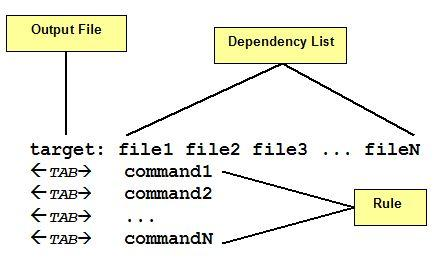

# Tutorial 1: Compiling with Make and GCC

Justin Nguyen 09/24/2019

This tutorial assumes basic knowledge of C programming.

_Basic Format of a Make target and rules [Source](https://www.codeproject.com/Articles/31488/Makefiles-in-Linux-An-Overview)_

1. Create a file called `Makefile` using your text editor of choice. 

_Makefiles can also use the lowercase 'makefile', but this is more unconventional._

2. Declare the following variables, `CC`, `PROGRAM_NAME`, `CFLAGS`, `LDFLAGS`, `C_HEADERS`, and `C_SOURCES`. Make allows you to declare variables with open assignment statements like so: `VARIABLE_NAME=`

_Variables in Make **CAN NOT** have spaces around the assignment operator (the `=` sign) nor a preceeding indent._

3. Make targets are unindented and are a name followed by a colon like so: `target:`. All variables must be referenced like so: `$(VARIABLE_NAME)`. The target for all should look like: `all: $(DEPENDANCY_1) $(DEPENDANCY_2)`. Multiple prerequisites (also called dependencies) can be listed separated by a space. Declare a Make target called `all`. Place `C_HEADERS, and C_SOURCES` as the prerequisites. The target for this rule should look like the following: `all: $(C_HEADERS) $(C_SOURCES)`.

_Placing names in the prerequisites list for a Make rule will cause Make to look if the file has changed, (or the respective Make rule output) has been created before running this rule._
_The first Make rule is called when `$ make` is called in the current directory. Since the rule is named 'all', `$ make all` will also run this rule._

4. Fill the body of the Make target with rules, or commands to complete this target. In this case we will be compiling a C program. The usual format for C compiler commands are `COMPILER_PROGRAM -o PROGRAM_NAME COMPILER_FLAGS C_SOURCES LINKER_FLAGS`. Write the Make rule following this format and utilizing the variables we created in step 2. Remember that you must reference variables using the `$(VARIABLE_NAME)` format. Keep in mind that `COMPILER PROGRAM` is the `CC` variable and `LINKER_FLAGS` is the `LDFLAGS` variable.

_The Make rules **MUST** be indented. For most C compilers, they will require the linker flags be last in the parameter list._

5. Create a special Make target called `.PHONY`. The format for this is the same as a Make rule. This target specifies that any prerequisites are phony targets (they do not create an output file). The prerequisite is called `clean`. This rule will not have a body.

6. Create a Make rule called `clean`. This rule does not require any prerequisites. The body of this rule (and any other Make rules) can execute arbitrary bash commands. This rule will delete a file called `PROGRAM_NAME`. The linux command for removing commands is `$ rm`.

7. Now that your Makefile template is complete for making a single target, fill in the variable names with the correct names. CC will usually be `gcc` or `clang`. Reccomended CFLAGS are `-Wall -Werror -g`. 

8. Run `$ make` from the command line and see if your program made successfully!

9. For the future, you can create additional Make rules andd variables to allow you to make multiple targets.
