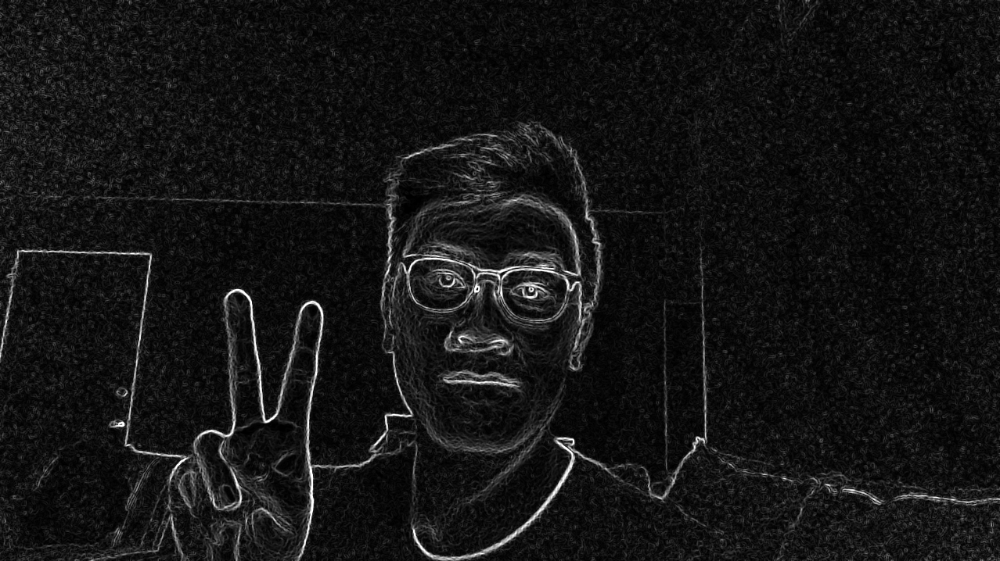

# Tutorial 2: OpenCV and Implementing the Sobel Filter

Justin Nguyen 09/30/2019

This tutorial assumes basic knowledge of C++, Makefiles, and Linux.



_Hello, Sobel!_

1. On most distributions of Linux, OpenCV needs to be built from source. Run the following commands from the terminal. This tutorial is based off of tutorials you can find online for building OpenCV on Ubuntu 18.04.

Upgrade your machine. Update repository to install latest dependencies.

```
$ sudo apt-get update -y
$ sudo apt-get upgrade -y
```

Install the dependencies for OpenCV.

```
$ sudo apt-get install build-essential 
$ sudo apt-get install cmake git libgtk2.0-dev pkg-config libavcodec-dev libavformat-dev \
  libswscale-dev cmake-curses-gui
$ sudo apt-get install python-dev python-numpy libtbb2 libtbb-dev libjpeg-dev libpng-dev \
  libtiff-dev libjasper-dev libdc1394-22-dev
```

Pull the latest release of OpenCV (currently 4.1.1).
 
```
$ wget https://github.com/opencv/opencv/archive/4.1.1.zip
```

Create the build directory and configuring OpenCV.

```
$ unzip 4.1.1.zip
$ cd opencv-4.1.1
$ mkdir build
$ cd build
$ ccmake ..
```

You should now be prompted with a nice GUI on configuring OpenCV. For now we will stick with the defaults. Press 'c' and wait for all the OpenCV build options to appear. Quit by pressing 'q'. This will save the configuration. Open ccmake again with the `$ ccmake ..` command and press 'g' to generate the build scripts (Makefile). After it has finished, press 'q' again to quit.

Building OpenCV. If you are using a VM, I would reccomend allocating more than 2GiB of memory and half of your computer's cores to the VM before running the command below. The make process will likely take 30+ minutes to build so go for a nice walk.

```
$ make -j$(nproc)
```

After OpenCV has built, install it.

```
$ sudo make install
```

We will want to use the standard OpenCV include paths (relative to `opencv2` not `opencv4/opencv2`) that is used in most tutorials online. Create a symlink (Linux shortcut) to `opencv4/opencv2` called `opencv2`.

```
$ cd /usr/local/include
$ ln -s opencv4/opencv2 opencv2
```

_You now have OpenCV installed._

2. Create a new folder for your assignment.

```
$ cd
$ mkdir <assignment_name>
```

3. Create two files. A `main.cpp` file for your program and a `Makefile`. You can create your own Makefile or use my template from [Tutorial 1](https://github.com/justinnuwin/CPE442/blob/master/tutorial1/Makefile).

4. Using your text editor of choice open the `Makefile`. Populate the fields using the values below:

- CC: `g++`
- PROGRAM_NAME: `<your_choice>`
- CFLAGS: `-Wall -Werror -g`
- LDFLAGS: `-lopencv_core -lopencv_highgui -lopencv_videoio -lopencv_imgcodecs -lm`
- C_HEADERS: `<add header files here if you create more>`
- C_SOURCES: `main..cpp <add more source files here if you create more>`

_The LDFLAGS field is for the linker to link external libraries into your program. For many libraries just including the include file is not enough as the include file does *not* contain the actual source of the library. For this program we are linking_ `opencv_core`, `opencv_highgui`, `opencv_videoio`, `opencv_imgcodecs`, _and_ `m`.

The OpenCV core library contains the neccessary OpenCV functions and datastructures. The OpenCV highgui library includes code for creating GUIs, displaying images, and drawing. The OpenCV videoio library has the neccessary code for opening videos through the VideoCapture interface. This interface supports many video formats in addition to webcams. The OpenCV imgcodecs library allows your program to open and save images of many types. The m library is the C standard math library.

5. Now open `main.cpp` with your text editor of choice. Include the following files. These includes correspond to the libraries we added to the linker in the previous step.

```
#include <opencv2/core.hpp>
#include <opencv2/videoio.hpp>
#include <opencv2/highgui.hpp>
#include <opencv2/imgcodecs.hpp>
#include <cmath>
```

6. Write the main function so that it takes a command line argument:

```
int main(int argc, char *argv[])
```

7. Create a VideoCapture object. This object has two constructors, one that takes an `int` which refers to the webcam index. There is a constructor that takes an `const string` referring to a path to a video file. The VideoCapture object also has a default constructor which initalizes the object without an input source which can later be speficied with the `open` function. When using the `open` method, the function returns a boolean whether the source was opened successfully.

```
VideoCapture cap(0);                    // Opens webcam 0
VideoCapture cap("exampleVideo.mp4");   // Opens the video file

// OR

VideoCapture cap;
bool isOpened = cap.open(0);                    // Opens webcam 0
bool isOpened = cap.open("exampleVideo.mp4");   // Opens the video file
```

8. In a while loop, you will want to read one frame of the video into a `Mat` object. The `Mat` object represents a n-dimensional dense array. The object has many attributes and methods that are not important for this tutorial. The main attributes and methods we will concern ourselves with are the following:

- `uchar *Mat::data`
- `int Mat::cols`
- `int Mat::rows`
- `void Mat::create(int rows, int cols, int type)`
- 
- `uchar *Mat::ptr(int row = 0)`
- `int Mat::type() const`

For the `Mat` types we will only be using `CV_8UC3` for 3 channel (color) 8-bit unsigned pictures and `CV_8UC1` for 1 channel (grayscale) 8-bit unsigned pictures.

The structure for the data sections of a `Mat` is for our 8-bit picture is

9. For the future, you can create additional Make rules andd variables to allow you to make multiple targets.
