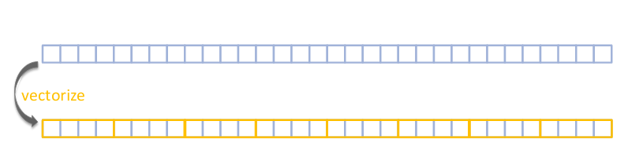

# Tutorial 4: Using SIMD

Justin Nguyen 10/18/2019

This tutorial assumes basic knowledge of C++, Makefiles, and Linux.

OpenMP is an open source API that is used to explicitly direct multi-threaded shared memory parallelism. The API relies on compiler flags, library functions, and environmental variables to enable this parallelism. By abstracting various parallelization strategies behind a standard API, many of these strategies can be standardized across a variety of shared memory architectures and platforms. The library also emphasizes its ease of use, portability, and lightwight footprint.

The main method for parallelizing tasks using OpenMP are using the compiler directives to signal to the compiler to utilize OpenMP to manipulate the data and pipeline its computation. Since we are focusing on SIMD vectorization, we will focus on the `simd` directive instead of the `parallel` directive.




Resources on OpenMP:

[SIMD Vectorization using OpenMP Slidedecj from Intel Talk](https://doc.itc.rwth-aachen.de/download/attachments/28344675/SIMD%20Vectorization%20with%20OpenMP.PDF?version=1&modificationDate=1480523704000&api=v2)

[General OpenMP Information from LLNL](https://computing.llnl.gov/tutorials/openMP/)

OpenMP provides threading and parallelization tools similar to how pthreads provides a POSIX compliant thread api. These can be mixed and matched, but keep in mind that OpenMP also provides higher level (and some lower level) abstraction on how explicit threading is performed. You may choose to keep your current POSIX threading and only use OpenMP for SIMD vectorization of the individual thread loops or use OpenMP to explicitly thread your grayscale and sobel operators. This tutorial will not cover the `parallel-*` required for threading using OpenMP, but the resources above should provide the information neccessary to do so.

1. Building with OpenMP:

OpenMP will require the `-fopenmp` compiler flag to be set. This can usually go in the `CFLAGS` section of your Makefile. For example:

```
CFLAGS=-Wall -Werror -g -fopenmp

all: $(C_SOURCES) $(C_HEADERS)
	$(CC) -o $(PROGRAM_NAME) $(CFLAGS) $(C_SOURCES) $(LDFLAGS)
```

2. Anatomy of OpenMP directive, they are formatted as so:

```
#pragma omp directive-name [clause, [clause, [...]]]
// The newline directly following the #pragma statement is required
// pragma statements are usually case sensitive
// only one directive-name may be specified per directive
// Long directive lines can be "continued" on succeeding lines by
// escaping the newline character with a backslash ("\") at the end
// of a directive line. 
```

_For the_ `simd` _directive, these cannot be nested._

2. We will be focusing on the directive `simd`. Here is a simple example:

```
#pragma omp simd
for-loops
```

What this does is it cuts the loop into chunks that fit a SIMD vector register. It *does not* parallelize the loop body (use `#pragma omp for simd` or `#pragma omp parallel for simd` instead). Remember, _SIMD = single instruction, multiple data_.

When no clauses are provided to the `simd` directive, it will try
and automatically vectorize the operation. The possible ramifications for
this include:

- Increased complexity of instructions makes it hard for the compiler to select proper instructions
- Code pattern needs to be recognized by the compiler
- Precision requirements often inhibit SIMD code gen

Usually the compiler will automatically attempt to vecotrize your code if
compiled the with level 3 optimization flag `-O3`.

3. The clauses that can be used for SIMD loops are:

- `private(var-list)`: Uninitialized vectors
- `reduction(op:var-list)`: Create private variables for `var-list` and apply a reduction operator `op` at the end of the construct. This is used only for operations that go from a vector to a single value.
- `safelen(length)`: Maximum vector length
- `simdlen(length)`: Length of SIMD registers (must be less than safelen)
- `linear(list[:linear-step])`: Variable's value is linearly related to the iteration value 
- `aligned(list[:alignment])`: The list is memory aligned
- `collapse(n)`: Number of loops associated with the construct

Here is an example for `sprod` a function which returns the scalar product of two arrays:

```
float sprod(float *a, float *b, int n) {
    float sum = 0.0f;
#pragma omp simd reduction(+:sum) 
    for (intk=0; k<n; k++)
        sum += a[k] * b[k];
    return sum;
}
```

Here is another example vectorizing a nested for loop:

```
int i, j;
#pragma omp simd private(j) collapse(2)
for (i = 0; i < n; i++) {
    // The nested for pattern does not allow declarations here
    for (j = 0; j < m; j++) {
        // Do work...
    }
}
```
